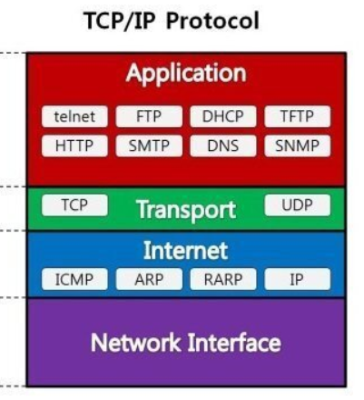
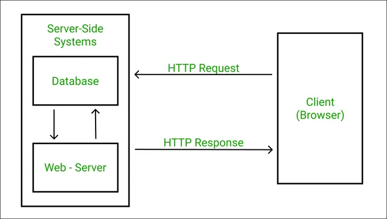
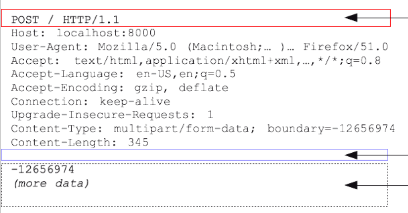
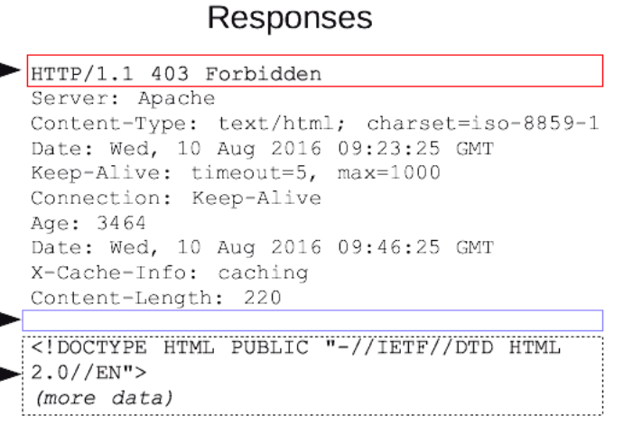

# HTTP - Request, Response 최종

### 목차

- HTTP는 무엇일까?
    - HTTP의 정의
        - 개념적 정의
        - 왜 필요한가
    - HTTP의 클라이언트-서버 구조 통신
    - HTTP Request와 Response가 어떻게 전달되는가 (Application Layer, TCP 세그먼트로 포장, 네트워크 상으로 전달)
- Request, Response를 통한 클라이언트-서버 통신
    - Request, Response의 개념
    - HTTP Message 포맷
        - HTTP 메세지 분석 절차
        - start-line
        - 헤더 구조
            - Request, Response 둘 다 가질 수 있는 헤더 필드 중 대표적인 것
                - Content-Type
                - Content-Length
                - Content-Encoding
            - 헤더를 통해 알 수 있는 데이터 전송 방식
                - 단순 전송: Content-Length
                - 압축 전송: Content-Encoding
                - 분할 전송: Transfer-Encoding
                - 범위 전송: Range, Content-Range
        - 메세지 바디
            - 페이로드를 담아서 전송한다 라고 이야기 함
    - Request Message 분석하기
        - Start-line: Request-line
            - 메소드 토큰: 서버에게 어떤 행위를 요청하는가
        - 어떤 헤더를 가질 수 있는가
            - 협상 헤더
                - Accept, Accept-Charset, Accept-Language, 등등
            - Host 정보: 요청에서 유일하게 필수적으로 들어가야 하는 헤더
    - Response Message 분석하기
        - Start-line: Status-line
            - 상태 코드
        - 헤더 필드
            - Date
            - Location
            - Allow
    - 언제까지 connection을 유지할까
        - 기본적으로는 연결을 유지하지 않는다고 정의되어 있는데, HTTP/1.1 이상에서는 “persistent connection”을 기본으로 한다고 함
        - 헤더의 Connection 필드로 이 요청/응답 다음에 커넥션을 종료할 것인지 여부를 명시할 수 있음 →요청응답이 계속해서 오가는 상황에서!


## 1. HTTP는 무엇인가

### 1. HTTP의 정의

- 공식 문서 HTTP 정의

  > HTTP is a generic interface protocol for information systems.  
  > It is designed to hide the details of how a service is implemented by presenting a uniform interface to clients that is independent of the types of resources provided.
  > Likewise, servers do not need to be aware of each client's purpose: an HTTP request can be considered in isolation rather than being associated with a specific type of client or a predetermined sequence of application steps.

- Hyper Text Transfer Protocol 의 약자
- HTTP는 네트워크를 기반으로 한 정보 시스템에서 사용하는 일반화 된 인터페이스 프로토콜(=약속, 규약)
    - 즉 **네트워크 기반의 서비스에서 사용하는 통신 규약**
- 균일화 된 인터페이스를 제공 → **클라이언트, 서버가 서로 상대가 어떤 종류인지 / 어떤 방식의 요청 및 응답을 보내는지 식별할 필요가 없어진다.**
    - HTTP라는 정형화 된 약속이 있기 때문에 이를 아는 것 만으로도 상대와 통신할 수 있다.
- HTTP 메세지를 통해 거의 모든 형태의 데이터를 전송할 수 있다.
    - HTML, TEXT, IMAGE, 영상, JSON, XML 등등…

### 2. HTTP의 클라이언트-서버 구조 통신

- HTTP 클라이언트: 서버와 connection을 설립하고, 한 개 이상의 Request를 보낸다.
- HTTP 서버: Connection을 수락하고, 받은 요청에 대한 resonse를 보낸다.
- ⇒ **HTTP는 요청과 응답을 주고받는 클라이언트-서버 구조**

> 클라이언트 ≠ 유저 에이전트
**클라이언트는 개념적으로 “요청을 보내는 측”을 의미하기 때문에 서버 - 서버 사이에서도 한 쪽은 클라이언트, 한 쪽은 서버의 역할을 하게 된다.**
>

### 3. HTTP는 Application Layer의 프로토콜이다.

- 가장 상단에 있는 Application Layer에서 동작하는 프로토콜
- 어플리케이션 계층에서 만들어진 HTTP 메세지가 하위 계층으로 내려오면서
    - TCP 세그먼트로 감싸짐 (포트 번호 정보 추가)
    - IP 프래그먼트로 감싸짐 (IP 정보 추가)
- 이후 네트워크를 통해 상대에게 전달됨



## 2. Request, Response를 통한 클라이언트-서버 통신

### 1. Request, Response의 개념

- Request: 클라이언트가 서버에게 요청을 보내서 서버가 동작하도록 하는 것
- Response: 서버가 자신이 받은 요청에 대해 응답하는 행위
- Request와 Response는 둘 다 HTTP Message 를 주고받는 것으로 이루어진다.
    - 클라이언트는 서버에게 Request Message의 형태로 Request를 보낸다.
    - 서버는 클라이언트의 요청에 하나, 혹은 그 이상의 응답을 보낸다.

  


### 2. HTTP Message 포맷

- 모든 HTTP/1.1 메세지는 다음과 같이 구성된다.

    ```
     HTTP-message   = start-line
                          *( header-field CRLF )
                          CRLF
                          [ message-body ]
    ```

    - start-line
        - Request Message에서는 Request Line 이라고 한다.
        - Response Message에서는 Status Line 이라고 한다.
    - 0개 이상의 헤더 필드 (header-field) → 아래는 헤더에 담기는 내용
        - Representation Meta data (표현 메타데이터, **body에 담기는 데이터를 해석하는데 필요한 정보**)
        - 클라이언트/서버의 정보
    - 빈 줄 (empty line, CRLF)
        - 헤더 섹션의 끝을 의미
    - message body
        - Payload(페이로드) body를 포함한다.
          → Payload: 단순히 전달하고자 하는 데이터 본문을 의미함
        - Message Body에 페이로드를 담는다
        - 메세지 본문 == 페이로드 로 이해해도 무방
        - **메세지 바디에는 전달하고자 하는 내용이 담긴다**

- **HTTP 메세지 분석 절차**
    1. start-line을 읽는다
    2. 각 헤더 필드를 Hash table 구조로 읽는다.
        - key(필드명):value(설정된 값) 의 구조로 읽는다고 이해하면 된다.
        - empty line(헤더 섹션의 끝)에 도달하기 전 까지 반복
    3. 분석된 헤더 데이터를 사용해 message body가 필요한지 여부를 판단한다.
    4. message body가 있다는 표시가 있을 경우 (ex. Content-Length의 길이, Transfer-Encoding 여부), body를 읽어들인다.

- **헤더 필드**
    - 필드명은 필드값이 헤더 필드에서 어떤 의미를 가지는지 나타낸다.
    - **헤더 필드는 자유롭게 확장 가능하다**
        - 새 필드명을 도입하고 새로운 의미를 정의할 수 있음
        - ex) `identity: wooteco-crew` 라는 필드를 임의로 추가할 수 있음 → identity 라는 필드의 값이 wooteco-crew
    - 헤더 필드의 순서는 상관이 없다.

### HTTP Message에서 **요청, 응답 모두 공통적으로 쓰이는 필드**

1. body에 대한 메타 데이터 (==표현(Representation) 헤더) → 본문에 대한 정보가 담긴 필드
- Content-Type: 전달할 데이터의 형식 ⇒ 필수
    - text/html, application/json, etc..
    - `,` 를 통해 여러 개 나열 가능
- Content-Length: 본문의 길이
    - Content-Length와 Transfer-Encoding은 같이 사용하면 안된다.
        - Transfer-Encoding 내부에 Content-Length 정보를 담고 있기 때문
- Content-Encoding: 데이터 압축 방식
    - 표현 데이터(body에 담기는 내용)을 압축하기 위해 사용
    - 송신 측: 데이터 압축 → 인코딩 헤더 추가
    - 수신 측: 해당 정보로 압축 해제
    - gzip, …

- **Message body**
    - 메세지 본문
    - 요청 또는 응답의 페이로드를 전달하는데 사용
    - 어떤 종류의 request, response인지에 따라 본문 허용 여부가 달라진다.
        - Request: Content-Length, 또는 Transfer-Encoding 필드가 있으면 본문이 있다는 의미
        - Response: 요청 메소드 + 응답 상태코드에 따라 body 존재 여부가 달라짐
            - HEAD 메소드에 대한 응답: body 없음
            - 204, 1XX, 304:  body 없음
            - **다른 응답들은 body를 가진다. (물론 길이가 0일 수는 있음)**

### 3. Request Message



- start-line == request-line
    - `{메소드 토큰} {타겟 리소스(정적 경로)} {프로토콜 버전} CRLF`
    - 공백 기준으로 끊어서 분석
    - 메소드 토큰: 타겟 리소스에서 수행할 작업 명시
        - CRUD
            - GET: 리소스 조회
                - 데이터 전달: 쿼리 파라미터 사용 `?name=포비`
                - body도 사용은 가능하지만, 서버가 이를 지원해야함
            - POST: 요청에 담긴 데이터 처리 (주로 등록)
                - body로 서버에 요청할 데이터 전달
                - 등록 후 새롭게 생성된 리소스의 위치를 반환하는 경우가 대부분
            - PUT: 리소스를 **완전히 다른 것으로 대체** (없으면 생성)
                - 클라이언트가 리소스의 위치를 알고 요청해야 한다! (이미 있는 것을 대체한다는 목적이므로)
            - PATCH: 리소스 부분 변경
                - ex) name, age 를 가지고 있던 리소스에서 age만 변경 요청 가능
            - DELETE: 리소스 삭제
        - 기타
            - HEAD: GET과 동일하지만 body 없이 start-line과 head 반환
            - OPTIONS: 대상 리소스에서 통신 가능한 HTTP Method를 알려줌
            - CONNECT: 서버 터널 설정
    - 타겟 리소스
        - `/` 부터 시작, 요청을 받을 리소스의 주소 명시
        - ex) `/boards/1` → 해석에 따라 다르지만 보통 boards에서 1번 위치의 리소스를 의미
    - 유효하지 않은 request-line을 수신하면 400  또는 301로 응답해야함

- Request가 가질 수 있는 헤더 필드
    - 협상 헤더: **클라이언트가 선호하는** 표현을 명시
        - Accept: 클라이언트가 선호하는 미디어 타입
        - Accept-Charset: 선호하는 문자 인코딩
        - Accept-Encoding: 선호하는 압축 방식
        - Accept-Language: 선호하는 언어
        - → 요청에 담기는 정보이기 때문에, 사실 실제 서버에서 어떻게 응답이 만들어지는 알 수가 없다.
        - **반드시 요청한 형태에 맞는 응답을 할 필요는 없다** → 보통은 서버에서 406 Not Acceptable 로 응답. 하지만 기술적으로 가능은 하다! (클라이언트가 response를 처리할 수 있긴 하다)
    - Host: 유일하게 필수적으로 들어가야 하는 헤더, ORIGIN 서버의 주소

### 4. Response Message



- Start-line == Status-line
    - `{프로토콜 버전} {상태 코드} {코드 설명 구문} CRLF`
    - 상태 코드: 3자리 정수, 서버가 클라이언트의 요청을 수행하려고 시도한 결과를 의미
        - 응답 메세지는 상태코드의 의미에 따라 해석에 영향을 받는다.
        - 2XX: 성공
            - 200 OK (ex. 요청된 리소스 조회 성공)
            - 201 Created: 새로운 리소스 생성 성공, 보통 Location 헤더 함께 반환
            - 202 Accepted: 접수 완료 BUT 처리 X (대기)
            - 204 No Content: 요청 성공, 보낼 응답  없음
        - 3XX: 리다이렉션
            - Location 헤더가 있으면 해당 위치로 자동 이동
            - 보통 리다이렉션으로 클라이언트가 추가 행위를 해야 요청이 완료될 경우에 사용
        - 4XX: 클라이언트 오류
            - 클라이언트가 잘못된 요청을 보낸 경우
            - 400 Bad Request → 메세지, 파라미터 오류 등
            - 401 Unauthorized → 클라이언트의 **인증(ex. 로그인을 통한 사용자 인증)** 필요
            - 403 Forbidden → **권한**이 없는 경우 (ex. 관리자 기능에 일반 사용자가 접근)
            - 404 Not Found → 요청한 리소스가 없는 경우
        - 5XX: 서버 오류
    - 설명 구문: 상태코드와 관련된 텍스트 설명을 제공

- 헤더 필드
    - Date: response 생성 날짜
    - Location: 페이지 리다이렉션
        - 웹: 3XX 응답에 해당 헤더가 있다면, 그 위치로 자동 이동
        - 201의 Location: 요청에 의해 생성된 리소스 URI
    - Allow: 허용 가능한 HTTP 메서드
        - OPTONS에 대한 response로 보통 204 상태코드와 함께 헤더에 Allow 정보 표시
        - 405 응답 (허용하지 않는 메소드) 일 때 헤더에 포함
    - Connection: Keep-Alive는 HTTP/1.1 이상 버전에서는 더 이상 사용하지 않음 (어차피 persistent connection을 기본값으로 사용하기 때문에 사용은 가능하지만, 특별한 의미를 가지지는 않는다.)

## 3. 하나의 Connection은 언제까지 유지될까

- 초기의 HTTP는 하나의 커넥션에서 한 쌍의 요청-응답이 오가는 방식이었지만, HTTP/1.1 부터 **Persistence Connection**이 기본이 됨
    - Persistence Connection: **하나의 connection에서 여러 개의 Request, Responser가 오가도록 한다는 의미**
    - HTTP connection이 한 번 맺어질 때 마다 이루어지는 TCP의 3 way handshake로 인한 시간 낭비 해결 가능
- 헤더의 Connection 필드로 “현재의 요청/응답 다음에 connection을 종료할 것인지”를 명시 가능
    - Connection: close
    - 요청, 응답 둘 다 해당 옵션 표시 가능
- 만약 connection이 열려있는데 요청/응답이 안 온다면 언제까지 열어두어야 할까?
    - HTTP 스펙 상으로는 “timeout을 요구하지는 않는다”
        - Timeout 에 대한 항목은 서버 혹은 클라이언트가 알아서 처리하라는 것이며 스펙에서 강제로 규정하지는 않는다는 의미
    - 일반적으로 통신이 종료되면 클라이언트 또는 서버에서 Connection:close 헤더로 통신 종료를 알린다. 그러나 꼭 close 신호를 보내지 않아도 OK
    - Persistence Connection을 사용한다 해도 일정기간이 지나면 timeout으로 처리 서버가 연결을 종료한다.


### 참고자료

1. RFC 7230 [https://datatracker.ietf.org/doc/html/rfc7230#section-3.1](https://datatracker.ietf.org/doc/html/rfc7230#section-3.1)
    1. RFC 7230 번역 문서 [https://roka88.dev/105](https://roka88.dev/105)
2. 김영한 - **[모든 개발자를 위한 HTTP 웹 기본 지식](https://www.inflearn.com/course/http-%EC%9B%B9-%EB%84%A4%ED%8A%B8%EC%9B%8C%ED%81%AC/dashboard)**
   → HTTP 메서드 종류, 상태 코드 종류
3. [그림으로 배우는 Http & Network Basic](https://product.kyobobook.co.kr/detail/S000000554505)
4. [https://medium.com/@reemshakes/http-request-response-flow-for-dummies-a0f52af83af3](https://medium.com/@reemshakes/http-request-response-flow-for-dummies-a0f52af83af3)
   → Request, Response Flow 이미지 출처
5. [https://developer.mozilla.org/ko/docs/Web/HTTP/Messages](https://developer.mozilla.org/ko/docs/Web/HTTP/Messages)
   → Request, Reponse Message 이미지 출처
6. [https://developer.mozilla.org/en-US/docs/Web/HTTP/Headers/Accept](https://developer.mozilla.org/en-US/docs/Web/HTTP/Headers/Accept) → Mozila accept header
7. [HTTP connection 유지](https://www.inflearn.com/questions/853462/comment/256353)
